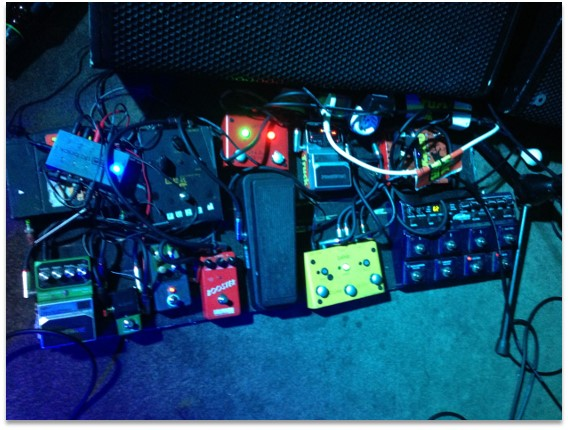
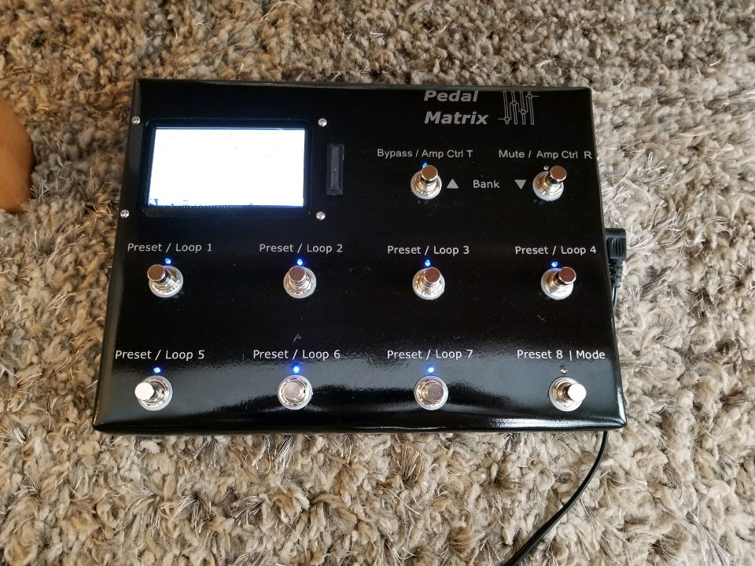
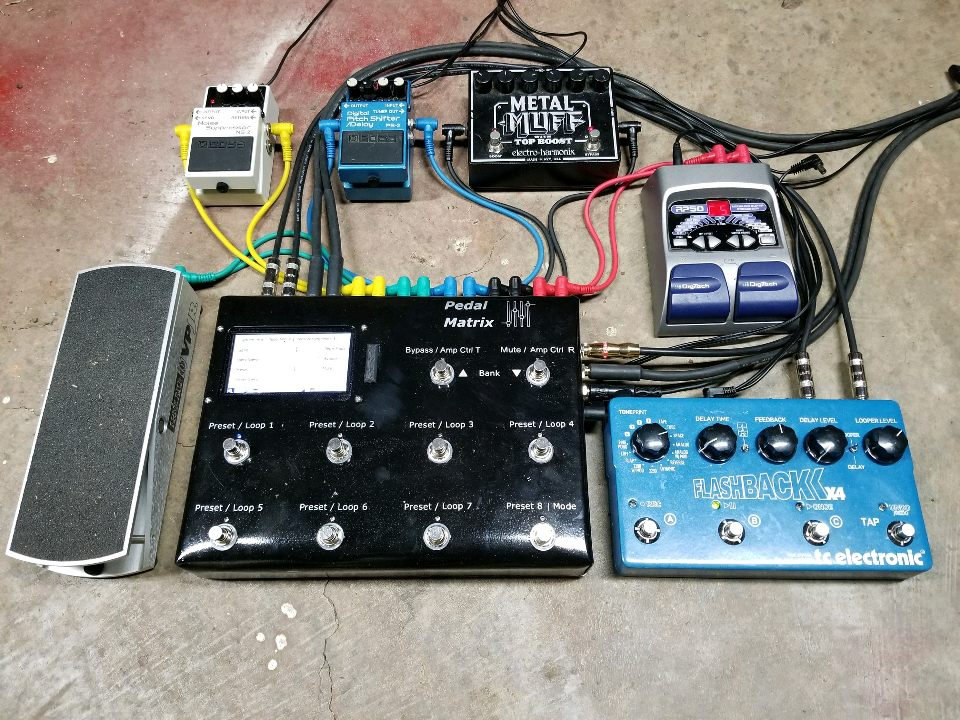

<a href="https://design.ece.msstate.edu/2017/team_meadows/" target="_blank">Official Project website and documentation located here</a>

Pedal Matrix is a guitar effects pedal manager that allows the musician to transform their town at the touch of a button. Traditionally, guitarists rely on several devices known as effects pedals to achieve their desired sound from the guitar. Often, the guitarist's pedalboard becomes disorganized and one is not able to easily swap between different sounds without manually configuring several pedals.

Pedal Matrix addresses this problem by acting as a guitar effects manager. Any guitarist can connect their desires effects pedals and then save several presets based on the tone that they need at the moment. At the touch of a button, during a live show, any guitarist can reconfigure their pedalboard to give them the sound that they desire.

