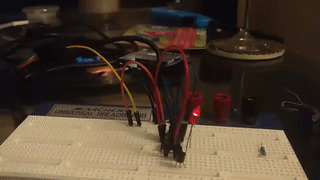

At FWA 2018 I held an introduction to soldering workshop. I decided that I would design a circuit board badge with some LEDs that attendees could populate at the panel. 

I used <a href="https://www.autodesk.com/products/eagle/overview" target="_blank">AutoDesk Eagle</a> to design the circuit and printed circuit board. For this project I wanted to make the LED effect as cool as possible while minimizing the number of components. I didn't expect any of the attendees to be experts so, minimizing the number of components to be soldered actually ensured that they were able to finish populating the board during the workshop.

To make the badges look as cool as possible, I really wanted to go for a nice analog fade effect. I found that I could do that using a TI 555 timer and some capacitors. Despite being an incredibly common device for hobbyists, I had never used one before. I was actually able to find a few around my supplies, which I suppose speaks to their popularity. The circuit boards were manufactured by <a href="https://www.seeedstudio.com/fusion_pcb.html" target="_blank">Seeedstudio</a>.

For the workshop I was able to borrow about 10 soldering irons form my peers. Thank goodness that my university requires everyone in the electrical and computer engineering department to purchase cheap soldering stations for a first year soldering project. Over the course of two workshops (and a third for those who needed it) over 60 people attended my lecture, and 30 were able to make the light up badges.

Overall, I had a great experience leading the workshop. Several people came up to me in the end and told me that I led a truly unique panel. Currently, I'm looking for the next big thing to do next year!
