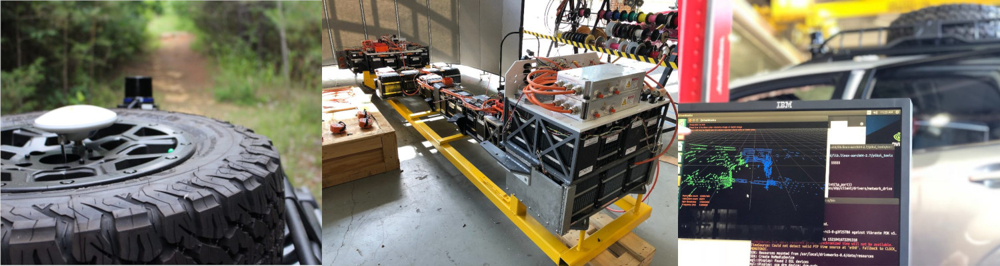

#More coming soon!

#Education

Bachelor's of Science in [Electrical Engineering](https://www.ece.msstate.edu/) from [Mississippi State University](https://www.msstate.edu/) - Spring 2018

Masters of Science in [Electrical and Computer Engineering](https://www.ece.msstate.edu/) from [Mississippi State University](https://www.msstate.edu/) - In progress, Summer 2019

#Experience

Currently, I hold a Graduate Research Position at the <a href="http://www.cavs.msstate.edu/" target="_blank">Center for Advanced Vehcicular Systems</a> at Mississippi State University. My undergraduate research was mostly on the <a href="https://www.msstate.edu/newsroom/article/2016/04/mississippi-state%E2%80%99s-%E2%80%98car-future%E2%80%99-revealed-detroit/" target="_blank">Car of the Future</a> project. Over three years I was also involved with several other projects where I developed several skills including:

* Automotive Harnessing
* Printed Circuit Board Design
* High Voltage Energy Storage systems
* 3D Modeling and Printing

My graduate research is focused on CAVS's <a href="http://www.cavs.msstate.edu/story.php?d=727" target="_blank">HALO project</a>. Previously, I was responsible for converting the vehicle into a "drive by wire" platform and electrifying it. Current efforts are directed towards developing this vehicle into an off-road autonomous vehicle.

My upcoming tasks include:

* Completing the Electrification of the Vehicle
* Multi-LiDAR Calibration
* LiDAR + IMU Calibration

#Interests

**Need to work on this more**

* 3D Modeling and Printing
* Broadcast Productions
* HiFi Audio
* Home-brewing
* Photography
* Racquetball
* Video Editing
